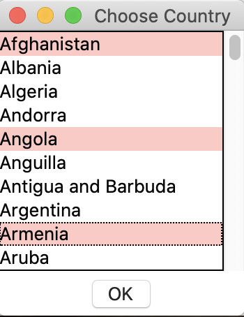

# Covid-19 info dashboard

The data are from the table of countries' Covid-19 info at the website: https://www.worldometers.info/coronavirus/

## lab3back.py

serves like backend, will produce a JSON file and an SQL database file

- Extract data from the [URL](https://www.worldometers.info/coronavirus/)
- Parse, clean the messy data, and store it in a JSON file
- Read data in from the JSON file and use sqlite3 to create an SQL database

## lab3front.py

serves like frontend, will read from the SQL database to display data to the user

### Main Window

The main window shows some statistics and 3 buttons for the user to view detailed data.

### New Cases

**New Cases** : the number of new cases and new deaths for the current day

### Top 20Cases

**Top 20Cases** : the 20 countries with the highest number of cases

### Compare Countries

**Compare Countries** : a plot of the number of cases for the countries of their choice, so they can visually compare the countries.
